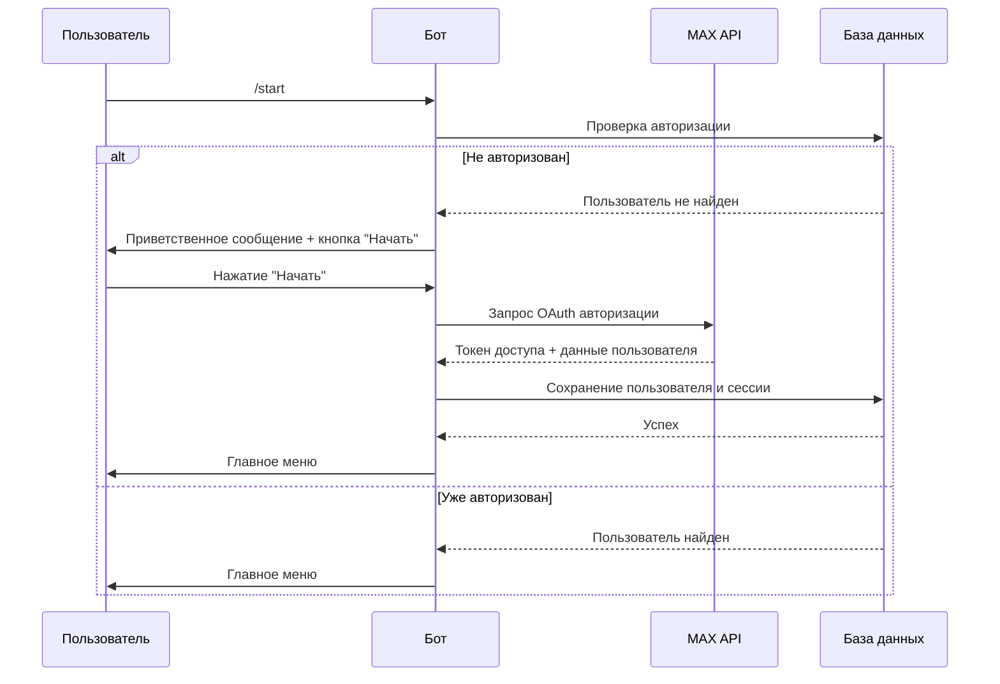
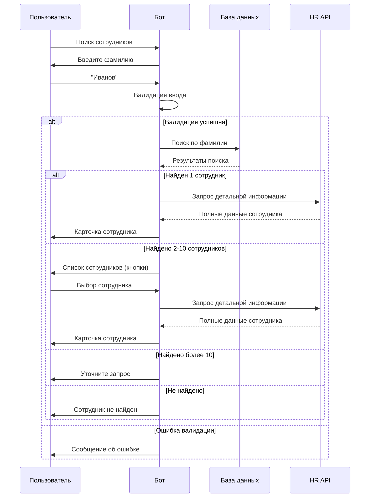
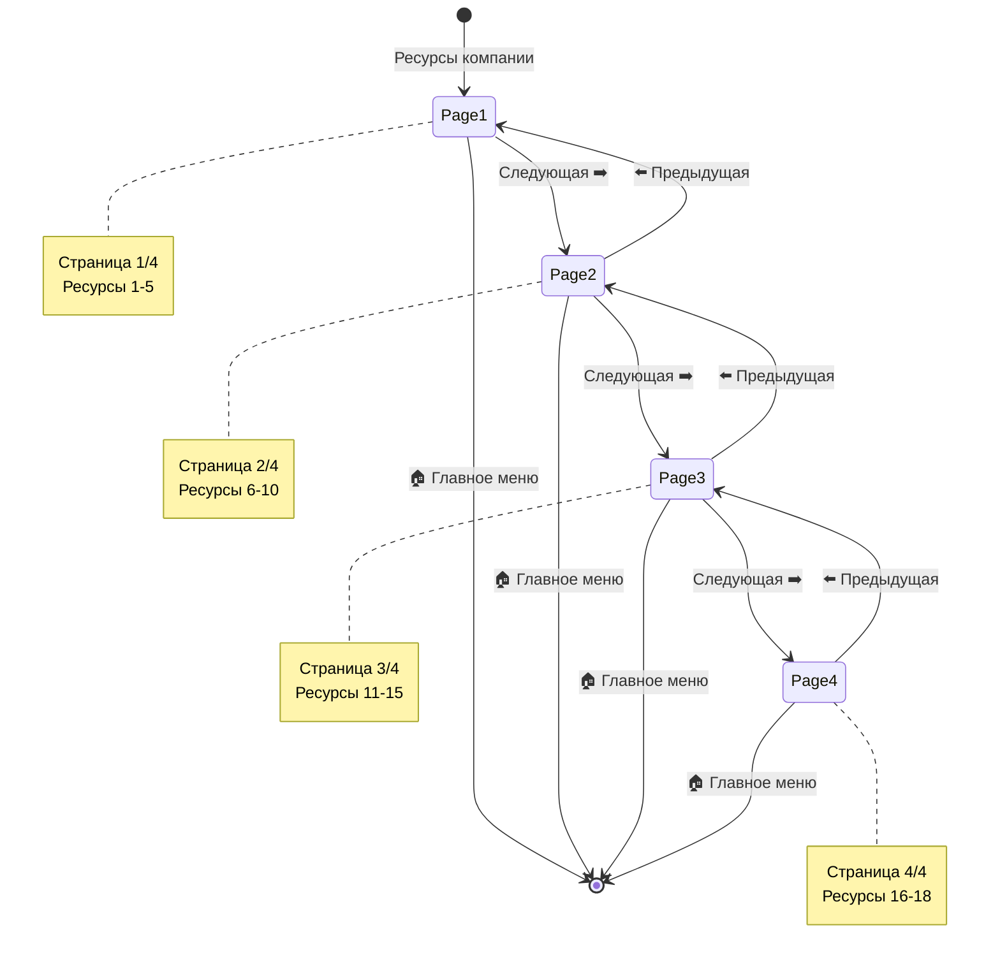
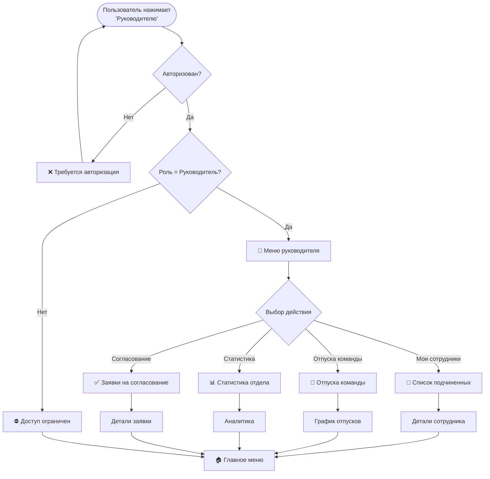
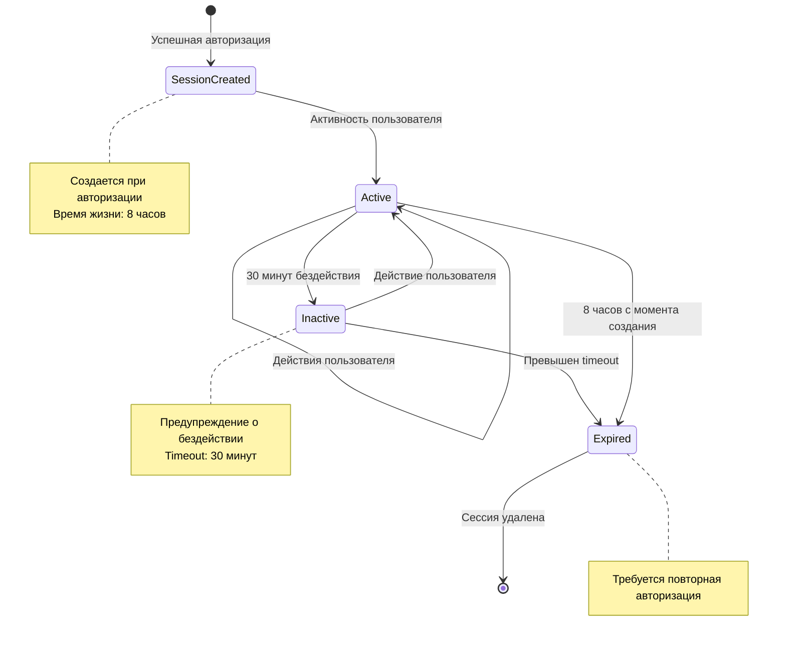
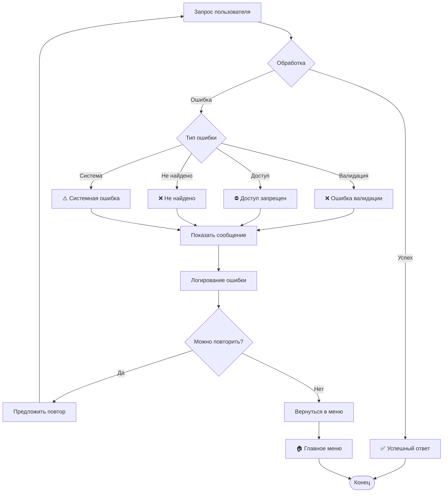
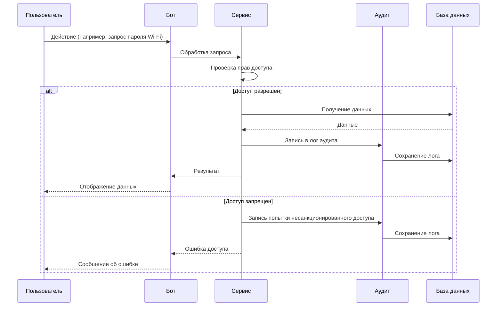
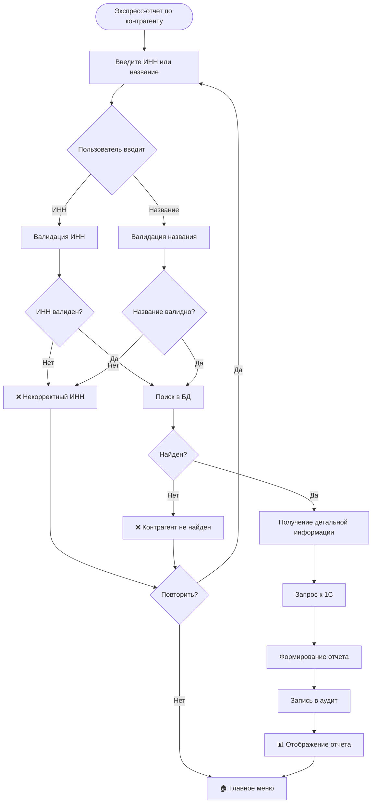

# Диаграммы состояний чат-бота "Михалыч"

## Основная диаграмма состояний

```mermaid
stateDiagram-v2
    [*] --> UNAUTHORIZED: Первый запуск
    
    UNAUTHORIZED --> AUTH_PENDING: Команда /start
    AUTH_PENDING --> AUTHORIZED: Успешная авторизация
    AUTH_PENDING --> UNAUTHORIZED: Ошибка авторизации
    
    AUTHORIZED --> MAIN_MENU: Переход в меню
    
    MAIN_MENU --> SEARCH_EMPLOYEE_INPUT: Поиск сотрудников
    MAIN_MENU --> SHOW_RESOURCES: Ресурсы компании
    MAIN_MENU --> VACATION_INFO: Хочу в отпуск
    MAIN_MENU --> WIFI_PASSWORD: Пароль Wi-Fi
    MAIN_MENU --> CONTRACTOR_REPORT_INPUT: Экспресс-отчет
    MAIN_MENU --> MANAGER_MENU: Раздел руководителя
    MAIN_MENU --> MODULE_UNAVAILABLE: Неактивный модуль
    
    SEARCH_EMPLOYEE_INPUT --> SEARCH_EMPLOYEE_RESULTS: Ввод фамилии
    SEARCH_EMPLOYEE_INPUT --> VALIDATION_ERROR: Ошибка валидации
    SEARCH_EMPLOYEE_RESULTS --> EMPLOYEE_DETAILS: Выбор сотрудника
    SEARCH_EMPLOYEE_RESULTS --> MAIN_MENU: Главное меню
    
    SHOW_RESOURCES --> RESOURCES_PAGE_NAVIGATION: Навигация по страницам
    RESOURCES_PAGE_NAVIGATION --> SHOW_RESOURCES: Смена страницы
    SHOW_RESOURCES --> MAIN_MENU: Главное меню
    
    VACATION_INFO --> VACATION_BALANCE: Остаток дней
    VACATION_INFO --> MAIN_MENU: Главное меню
    VACATION_BALANCE --> MAIN_MENU: Главное меню
    
    WIFI_PASSWORD --> MAIN_MENU: Главное меню
    
    CONTRACTOR_REPORT_INPUT --> CONTRACTOR_REPORT_RESULTS: Ввод ИНН
    CONTRACTOR_REPORT_INPUT --> VALIDATION_ERROR: Ошибка валидации
    CONTRACTOR_REPORT_RESULTS --> MAIN_MENU: Главное меню
    
    MANAGER_MENU --> SUBORDINATES_LIST: Мои сотрудники
    MANAGER_MENU --> TEAM_VACATIONS: Отпуска команды
    MANAGER_MENU --> DEPARTMENT_STATS: Статистика отдела
    MANAGER_MENU --> APPROVE_REQUESTS: Согласование заявок
    MANAGER_MENU --> MAIN_MENU: Главное меню
    
    SUBORDINATES_LIST --> SUBORDINATE_DETAILS: Детали сотрудника
    SUBORDINATE_DETAILS --> SUBORDINATES_LIST: Назад
    TEAM_VACATIONS --> MANAGER_MENU: Назад
    DEPARTMENT_STATS --> MANAGER_MENU: Назад
    APPROVE_REQUESTS --> REQUEST_DETAILS: Выбор заявки
    REQUEST_DETAILS --> APPROVE_REQUESTS: Назад
    
    SUBORDINATES_LIST --> MAIN_MENU: Главное меню
    TEAM_VACATIONS --> MAIN_MENU: Главное меню
    DEPARTMENT_STATS --> MAIN_MENU: Главное меню
    APPROVE_REQUESTS --> MAIN_MENU: Главное меню
    
    MODULE_UNAVAILABLE --> MAIN_MENU: Главное меню
    
    EMPLOYEE_DETAILS --> MAIN_MENU: Главное меню
    CONTRACTOR_REPORT_RESULTS --> MAIN_MENU: Главное меню
    
    VALIDATION_ERROR --> SEARCH_EMPLOYEE_INPUT: Повтор ввода
    VALIDATION_ERROR --> CONTRACTOR_REPORT_INPUT: Повтор ввода
    VALIDATION_ERROR --> MAIN_MENU: Главное меню
```

## Диаграмма процесса авторизации

## Диаграмма поиска сотрудника

## Диаграмма навигации по ресурсам

## Диаграмма доступа к разделу руководителя

## Диаграмма жизненного цикла сессии

## Диаграмма обработки ошибок

## Диаграмма аудита действий

## Диаграмма получения экспресс-отчета

## Легенда

### Состояния
- **UNAUTHORIZED** — пользователь не авторизован
- **AUTH_PENDING** — процесс авторизации
- **AUTHORIZED** — успешная авторизация
- **MAIN_MENU** — главное меню
- **SEARCH_EMPLOYEE_INPUT** — ожидание ввода для поиска сотрудника
- **SEARCH_EMPLOYEE_RESULTS** — отображение результатов поиска
- **EMPLOYEE_DETAILS** — детальная информация о сотруднике
- **SHOW_RESOURCES** — отображение ресурсов компании
- **RESOURCES_PAGE_NAVIGATION** — навигация по страницам ресурсов
- **VACATION_INFO** — информация об отпусках
- **VACATION_BALANCE** — остаток отпускных дней
- **WIFI_PASSWORD** — отображение паролей Wi-Fi
- **CONTRACTOR_REPORT_INPUT** — ожидание ввода для отчета
- **CONTRACTOR_REPORT_RESULTS** — отображение отчета по контрагенту
- **MANAGER_MENU** — меню руководителя
- **SUBORDINATES_LIST** — список подчиненных
- **SUBORDINATE_DETAILS** — детали подчиненного
- **TEAM_VACATIONS** — отпуска команды
- **DEPARTMENT_STATS** — статистика отдела
- **APPROVE_REQUESTS** — список заявок на согласование
- **REQUEST_DETAILS** — детали заявки
- **MODULE_UNAVAILABLE** — модуль недоступен
- **VALIDATION_ERROR** — ошибка валидации

### Действия
- **Команда /start** — запуск бота
- **Нажатие кнопки** — взаимодействие с inline-кнопками
- **Ввод текста** — ввод данных пользователем
- **Переход в меню** — возврат в главное меню
- **Валидация** — проверка введенных данных
- **Запрос к API** — обращение к внешним системам

### Символы
- ✅ — успешная операция
- ❌ — ошибка
- ⚠️ — предупреждение
- ⛔ — доступ запрещен
- 🏠 — главное меню
- 👔 — раздел руководителя
- 📊 — отчеты и статистика
- 🔐 — безопасность и авторизация
