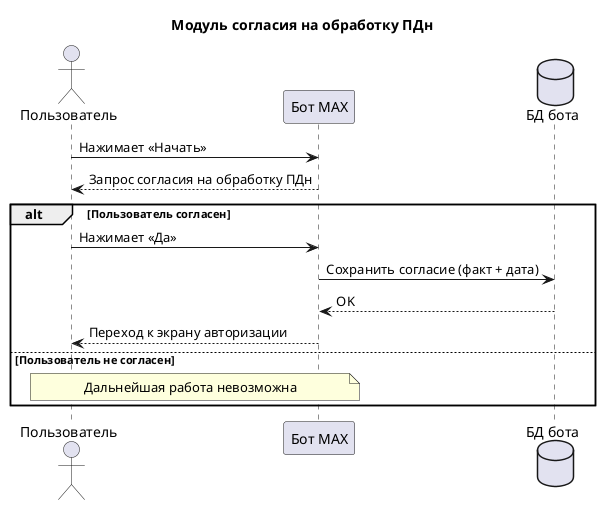
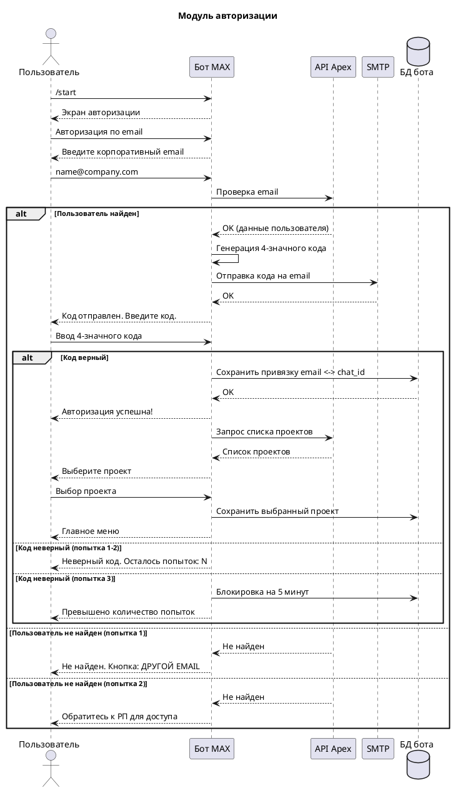
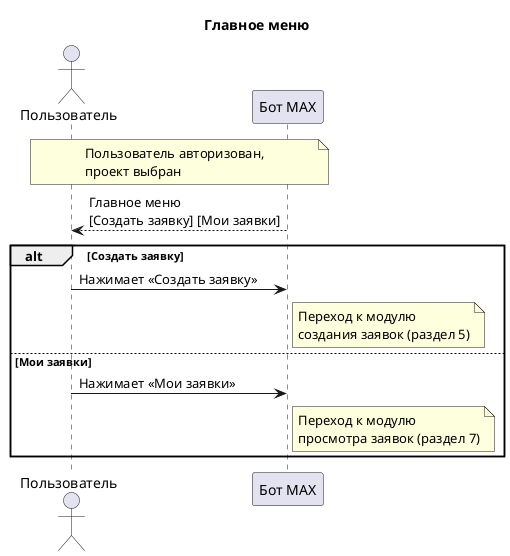
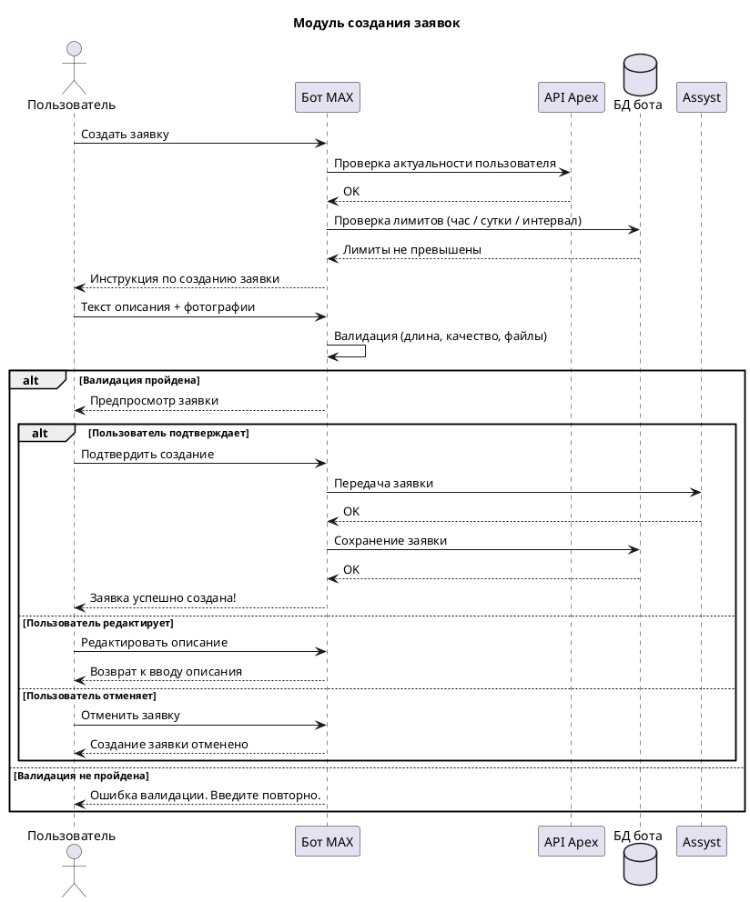
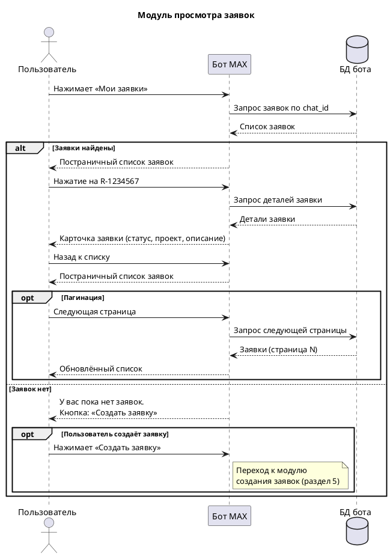
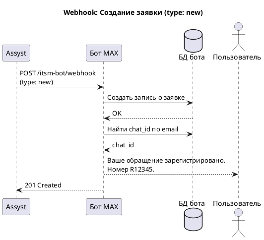
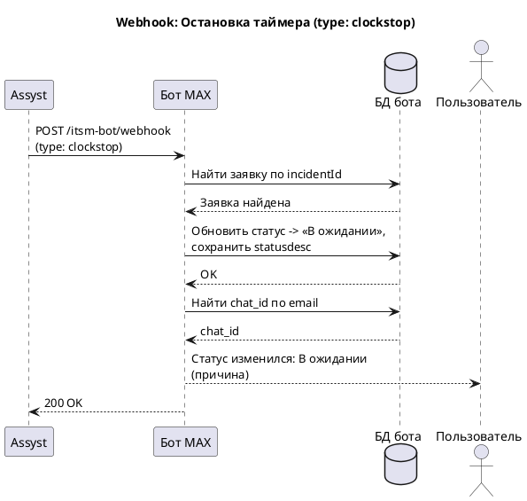
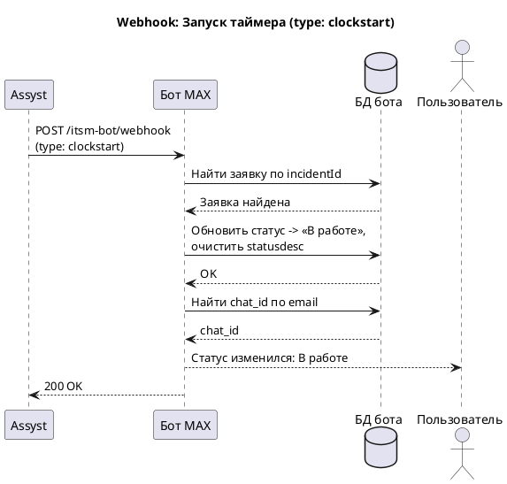
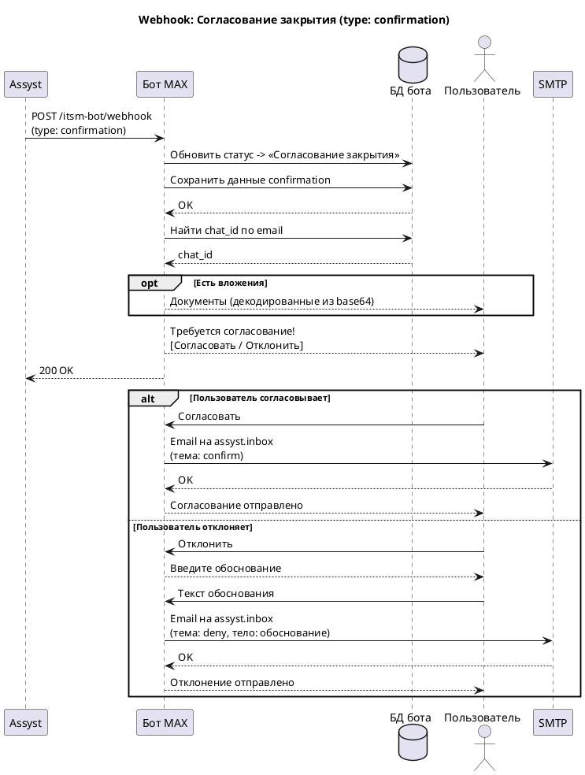
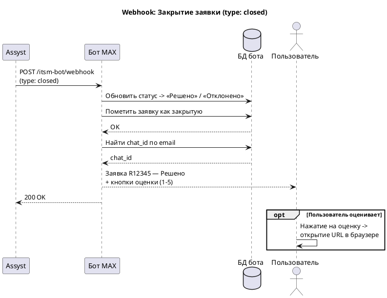

# Техническое задание: Бот MAX для обращений в систему Assyst

---

## 1. Общие положения

### 1.1. Назначение системы

Бот **MAX** — единая точка входа для приёма, создания и отслеживания обращений пользователей в ITSM-систему Assyst. Бот выполняет роль посредника между пользователями и службой технической поддержки, обеспечивая двустороннее взаимодействие через мессенджер.

### 1.2. Цели

* **Снижение нагрузки** на специалистов технической поддержки за счёт автоматизации приёма обращений.
* **Сокращение времени регистрации** обращения до 15 минут.
* **Автоматизация процесса** создания, отслеживания и обработки заявок.
* **Оперативное информирование** пользователей об изменениях статуса заявок через push-уведомления в MAX.

### 1.3. Архитектура взаимодействия

```
Пользователь ↔ Бот MAX ↔ API Apex (авторизация / проверка пользователей)
                        ↔ SMTP (отправка кодов / согласования)
                        ↔ Assyst (webhooks: создание, статусы, закрытие)
                        ↔ БД бота (хранение сессий, заявок, пользователей)
```

### 1.4. Основные потоки

| № | Поток | Инициатор | Направление |
|---|-------|-----------|-------------|
| 1 | Согласие на обработку ПДн | Пользователь | MAX → Бот → БД |
| 2 | Авторизация пользователя | Пользователь | MAX → Бот → Apex → SMTP |
| 3 | Создание заявки | Пользователь | MAX → Бот → Assyst |
| 4 | Просмотр заявок | Пользователь | MAX → Бот → БД |
| 5 | Уведомление о новой заявке | Assyst | Assyst → Webhook → Бот → MAX |
| 6 | Изменение статуса заявки | Assyst | Assyst → Webhook → Бот → MAX |
| 7 | Согласование закрытия | Assyst | Assyst → Webhook → Бот → MAX → SMTP → Assyst |
| 8 | Закрытие и оценка заявки | Assyst | Assyst → Webhook → Бот → MAX |

---

## 2. Модуль согласия на обработку персональных данных

### 2.1. Сценарий: Первый запуск бота

**Условие**: Пользователь впервые взаимодействует с ботом (отсутствует запись о согласии в БД).

1. **Пользователь** нажимает кнопку `Начать`.
2. **Бот** отображает запрос согласия на обработку персональных данных:

   ```
   Для работы с ботом необходимо ваше согласие на обработку персональных данных.

   Ознакомиться с полным текстом: [ссылка на onlanta.ru]
   ```

   Кнопка: `Да` — пользователь даёт согласие.

3. **При нажатии «Да»**:
   * В БД сохраняется факт и дата согласия.
   * Бот переходит к экрану авторизации (раздел 3).

4. **Без согласия** дальнейшая работа с ботом невозможна.

> **Примечание**: Текст согласия предоставляет СИБ; ссылка ведёт на страницу на сайте onlanta.ru с полным текстом согласия.

### 2.2. Диаграмма последовательности



---

## 3. Модуль авторизации

### 3.1. Сценарий: Экран авторизации

**Условие**: Пользователь дал согласие на обработку ПДн, но ещё не авторизован (или сессия истекла).

1. **Пользователь** вводит команду `/start` (или переходит после согласия).
2. **Бот** отображает сообщение:

   ```
   🔐 АВТОРИЗАЦИЯ В СИСТЕМЕ

   Выберите способ авторизации:
   • 📧 АВТОРИЗАЦИЯ ПО EMAIL
   ```

### 3.2. Сценарий: Авторизация по email

1. **Пользователь** выбирает `📧 АВТОРИЗАЦИЯ ПО EMAIL`.
2. **Бот** запрашивает email:

   ```
   Введите ваш корпоративный email:
   ```

3. **Пользователь** вводит email (например, `name@company.com`).

4. **Проверка в Apex**:

   * **Успех** (пользователь найден):
     * Бот генерирует 4-значный код и отправляет его на указанный email.
     * Сообщение:

       ```
       Код отправлен на name@company.com.
       Введите 4-значный код из письма:
       ```

   * **Пользователь не найден (первая попытка)**:

     ```
     ❌ Пользователь с таким email не найден.
     Попробуйте другой email или выберите иной способ авторизации.
     ```

     Кнопка: `📧 ДРУГОЙ EMAIL`

   * **Пользователь не найден (вторая попытка подряд)**:

     ```
     ❌ Пользователь не найден.
     Обратитесь к руководителю проекта (РП) для получения доступа.
     ```

### 3.3. Сценарий: Ввод кода подтверждения

1. **Пользователь** вводит 4-значный код.

2. **Успешная проверка**:

   ```
   ✅ Авторизация успешна!
   ```

   * В БД сохраняется привязка: email ↔ chat_id.
   * Отображается список проектов пользователя (названия проектов из Apex).
   * Кнопка «Подтвердить» для выбора проекта.
   * После выбора проекта → главное меню (раздел 4).

3. **Ошибки ввода кода**:

   * **1-я ошибка**:
     ```
     ❌ Неверный код. Осталось попыток: 2
     ```
   * **2-я ошибка**:
     ```
     ❌ Неверный код. Осталось попыток: 1
     ```
   * **3-я ошибка**:
     ```
     ❌ Превышено количество попыток ввода кода.
     Начните авторизацию заново через 5 минут: /start
     ```

### 3.4. Параметры безопасности авторизации

| Параметр | Значение |
|----------|----------|
| Срок действия кода подтверждения | 5 минут |
| Максимум попыток ввода кода | 3 |
| Максимум попыток поиска пользователя | 2 подряд |
| Блокировка после превышения попыток | 5 минут |

### 3.5. Диаграмма последовательности



---

## 4. Главное меню

После успешной авторизации и выбора проекта пользователю доступны:

* `📋 Создать заявку` — переход к созданию новой заявки (раздел 5).
* `📒 Мои заявки` — просмотр списка своих заявок (раздел 7).

### 4.1. Диаграмма последовательности



---

## 5. Модуль создания заявок (инициация пользователем)

### 5.1. Сценарий: Инициализация создания заявки

1. **Пользователь** нажимает кнопку `📋 Создать заявку`.
2. **Бот** выполняет проверку пользователя в Apex (актуальность учётной записи).
3. **Проверка лимитов** (раздел 6).
4. **При успешных проверках** бот отправляет инструкцию:

   ```
   📝 СОЗДАНИЕ НОВОЙ ЗАЯВКИ

   Введите подробное описание проблемы и прикрепите до 10 фотографий,
   если необходимо.

   Требования к описанию:
   • Минимум 20 символов
   • Максимум 1000 символов
   • Не должно состоять из повторяющихся символов

   Для отмены введите /cancel
   ```

### 5.2. Сценарий: Ввод и валидация данных заявки

1. **Пользователь** отправляет текст описания и/или фотографии.
2. **Система проверяет**:

   | Параметр | Требование |
   |----------|------------|
   | Длина текста | 20–1000 символов |
   | Качество текста | Отсутствие повторяющихся символов («aaaa», «1111») |
   | Пустые / пробельные строки | Запрещены |
   | Количество фотографий | До 10 файлов |
   | Тип файлов | Только изображения: JPEG, PNG, JPG |
   | Размер файла | До 10 МБ каждый |

3. **Результаты проверки**:

   * **Успех** → переход к подтверждению заявки (5.3).
   * **Ошибка**:

     ```
     ❌ Описание проблемы должно содержать:
     • Минимум 20 символов
     • Развернутое описание
     • Не состоять из повторяющихся символов

     Введите описание повторно:
     ```

### 5.3. Сценарий: Подтверждение заявки

1. **Бот** формирует сводку заявки:

   ```
   📋 ПРЕДВАРИТЕЛЬНЫЙ ПРОСМОТР ЗАЯВКИ

   🏢 Проект: [Название выбранного проекта]
   👤 Пользователь: [Имя Фамилия]
   📧 Email: [user@company.com]
   📞 Телефон: [+7XXX XXX XX XX]

   🎯 Описание проблемы:
   [Введённое пользователем описание проблемы]

   📎 Прикреплённые файлы: [X] фото

   Подтверждаете создание заявки?
   ```

2. **Интерактивные кнопки**:
   * `✅ ПОДТВЕРДИТЬ СОЗДАНИЕ` — финализация заявки.
   * `✏️ РЕДАКТИРОВАТЬ ОПИСАНИЕ` — возврат к редактированию.
   * `❌ ОТМЕНИТЬ ЗАЯВКУ` — полная отмена.

### 5.4. Сценарий: Финальная обработка заявки

**При подтверждении**: бот передаёт обращение в Assyst. Предварительная запись заявки сохраняется в БД бота со статусом «Отправлена» и `source = 'bot'`. После получения webhook `type: new` от Assyst запись обновляется полями `incident_id` и `event_reference`.

```
✅ Заявка успешно создана!

📊 Детали заявки:
• Проект: [Название проекта]
• Статус: 📋 Зарегистрирована

⏳ Следующую заявку можно создать через 15 минут.
```

**При редактировании**: возврат к шагу ввода описания (5.2), ранее прикреплённые файлы сохраняются.

**При отмене**:

```
❌ Создание заявки отменено.
Для возврата в главное меню используйте /start
```

### 5.5. Диаграмма последовательности



---

## 6. Система ограничений на создание заявок

### 6.1. Лимиты

| Параметр | Значение |
|----------|----------|
| Максимум заявок в час | 5 |
| Максимум заявок в сутки | 10 |
| Минимальный интервал между заявками | 15 минут |

### 6.2. Сообщения при превышении лимитов

* **Часовой лимит**:

  ```
  ❌ Превышено количество заявок в час (5/5).
  Доступно создание новой заявки через: [время] минут.
  ```

* **Суточный лимит**:

  ```
  ❌ Превышено количество заявок в сутки (10).
  Новые заявки будут доступны завтра.
  ```

* **Интервал не пройден**:

  ```
  ❌ Слишком частые запросы.
  Следующую заявку можно создать через: [время] минут.
  ```

---

## 7. Модуль просмотра заявок

### 7.1. Кнопка `📒 Мои заявки`

**Источник данных**: только БД бота (прямых запросов в Assyst не выполняется).

1. Бот определяет пользователя по `chat_id`.
2. Выбирает из БД все заявки, связанные с этим пользователем.
3. Формирует постраничный список.

**Формат сообщения**:

```
Список ваших заявок:

📋 R-12345678   📋 R-1234578   📋 R-1234567
📋 R-12345679   📋 R-1234580   📋 R-1234581

◀️ Предыдущая              Следующая ▶️
```

**Требования**:

* Каждая заявка — inline-кнопка с префиксом `📋` и номером (`eventReference`).
* Пагинация:
  * `◀️ Предыдущая` — переход к предыдущей странице (если есть).
  * `Следующая ▶️` — переход к следующей странице (если есть).
* При нажатии на заявку — переход к деталям (7.2).

**Если список пуст**:

```
У вас пока нет заявок. Создайте новую через кнопку «Создать заявку».
```

Кнопка: `📋 Создать заявку` (= `/new`)

### 7.2. Детальная информация о заявке

По нажатию на кнопку конкретной заявки бот показывает:

```
📋 Заявка R-1234567
📊 Статус: В работе
🏢 Проект: ПИКТ
📅 Создана: 19.01.2025 13:23
🎯 Описание: Текст заявки.
📎 Вложений: 1
```

Кнопка: `🗂 Назад к списку` — возврат к списку с сохранением текущей страницы.

### 7.3. Диаграмма последовательности



---

## 8. Модуль обработки событий из Assyst (Webhooks)

Assyst отправляет POST-запросы на эндпоинт бота для уведомления о событиях, связанных с заявками.

**Общий эндпоинт**: `POST /itsm-bot/webhook`

### 8.1. Перечень событий

| Тип события (`type`) | Описание | Раздел |
|----------------------|----------|--------|
| `new` | Создание / регистрация заявки в Assyst | 8.2 |
| `clockstop` | Остановка таймера (заявка в ожидании) | 8.3 |
| `clockstart` | Запуск таймера (заявка снова в работе) | 8.4 |
| `confirmation` | Запрос согласования закрытия | 8.5 |
| `closed` | Закрытие заявки | 8.6 |

### 8.2. Событие: Создание заявки (`type: new`)

#### 8.2.1. Условие на стороне Assyst

Первое действие **ASSIGN** на реквесте (префикс `R`) или инциденте (без префикса).

#### 8.2.2. Формат Webhook

```json
{
  "type": "new",
  "email": "example@mail.ru",
  "incidentId": 512345,
  "eventReference": "R12345",
  "status": "В работе",
  "subject": "Не работает принтер",
  "description": "Не работает принтер\nВсё плохо"
}
```

| Поле | Тип | Описание |
|------|-----|----------|
| `type` | string | Тип события: `"new"` |
| `email` | string | Email затронутого пользователя |
| `incidentId` | int | Внутренний ID заявки в Assyst |
| `eventReference` | string | Номер заявки для отображения пользователю |
| `status` | string | Текущий статус заявки |
| `subject` | string | Тема заявки |
| `description` | string | Описание заявки |

#### 8.2.3. Обработка на стороне бота

1. Если заявка была создана через бот (`source = 'bot'`) — обновить существующую запись полями `incidentId`, `eventReference`, `status`. Иначе — создать новую запись в БД (`source = 'assyst'`).
2. Определить пользователя по `email` → найти связанный `chat_id`. Если пользователь не найден в БД бота — заявка сохраняется, уведомление не отправляется (пользователь не авторизован в боте).
3. Отправить пользователю уведомление:

   ```
   ✅ Ваше обращение зарегистрировано.
   Присвоен номер R12345.

   📋 Открыть заявку
   ```

   Кнопка `📋 Открыть заявку` — показывает детали заявки (раздел 7.2).

#### 8.2.4. Ответ

* `201 Created` — запись о заявке успешно создана в БД бота.

#### 8.2.5. Диаграмма последовательности



---

### 8.3. Событие: Остановка таймера (`type: clockstop`)

#### 8.3.1. Условие на стороне Assyst

Действие **PENDING xxx** на реквесте (R-префикс) или инциденте (без префикса).

#### 8.3.2. Формат Webhook

```json
{
  "type": "clockstop",
  "email": "example@mail.ru",
  "incidentId": 512345,
  "eventReference": "R12345",
  "status": "В ожидании",
  "statusdesc": "Запрошена уточняющая информация"
}
```

| Поле | Тип | Описание |
|------|-----|----------|
| `statusdesc` | string | Причина перевода в ожидание (текст из действия PENDING) |

#### 8.3.3. Обработка на стороне бота

1. Найти в БД заявку по `incidentId` или `eventReference`.
2. Обновить статус заявки на «В ожидании».
3. Сохранить причину изменения статуса (`statusdesc`).
4. Отправить пользователю уведомление:

   ```
   🔔 Статус заявки изменился!
   🔢 Номер: R12345
   📊 Новый статус: В ожидании
   📌 Причина смены статуса: Запрошена уточняющая информация
   📅 Время: 19.01.2025 13:23

   📋 Открыть заявку
   ```

#### 8.3.4. Ответ

* `200 OK` — информация обновлена.

#### 8.3.5. Диаграмма последовательности



---

### 8.4. Событие: Запуск таймера (`type: clockstart`)

#### 8.4.1. Условие на стороне Assyst

* Действие **START CLOCK** на реквесте / инциденте, или
* Действие **RE-OPEN** на инциденте.

#### 8.4.2. Формат Webhook

```json
{
  "type": "clockstart",
  "email": "example@mail.ru",
  "incidentId": 512345,
  "eventReference": "R12345",
  "status": "В работе",
  "statusdesc": ""
}
```

#### 8.4.3. Обработка на стороне бота

1. Найти заявку в БД по `incidentId` / `eventReference`.
2. Обновить статус заявки на «В работе».
3. Очистить причину смены статуса (`statusdesc` = пусто).
4. Отправить пользователю уведомление (**без** строки «Причина смены статуса»):

   ```
   🔔 Статус заявки изменился!
   🔢 Номер: R12345
   📊 Новый статус: В работе
   📅 Время: 19.01.2025 13:45

   📋 Открыть заявку
   ```

#### 8.4.4. Ответ

* `200 OK` — информация обновлена.

#### 8.4.5. Диаграмма последовательности



---

### 8.5. Событие: Запрос согласования закрытия (`type: confirmation`)

#### 8.5.1. Условие на стороне Assyst

Действие **USER_CONFIRMATION_REQ** на реквесте (R-префикс) или инциденте (без префикса).

#### 8.5.2. Формат Webhook

```json
{
  "type": "confirmation",
  "email": "example@mail.ru",
  "incidentId": 512345,
  "eventReference": "R12345",
  "status": "Согласование закрытия",
  "confirmation": {
    "description": "Текст согласования закрытия",
    "attachments": [
      {
        "filename": "text.txt",
        "data": "base64-encoded-content"
      }
    ],
    "confirm": "#p#R1193300 #OnlRef#D3297061 #key#... #anstxt#Согласовано #tag#a",
    "deny": "#p#R1193300 #OnlRef#D3297061 #key#... #anstxt#Не согласовано #tag#d"
  }
}
```

| Поле | Тип | Описание |
|------|-----|----------|
| `confirmation.description` | string | Текст согласования |
| `confirmation.attachments` | array | Массив вложений (filename + data в base64) |
| `confirmation.confirm` | string | Тема письма для ответа «Согласовано» |
| `confirmation.deny` | string | Тема письма для ответа «Не согласовано» |

#### 8.5.3. Обработка на стороне бота

1. Обновить статус заявки в БД на «Согласование закрытия».
2. Сохранить данные объекта `confirmation` (описание, вложения, темы писем для confirm/deny).
3. Если есть вложения — декодировать base64 и отправить как документы.
4. Отправить пользователю уведомление:

   ```
   🔔 Требуется ваше согласование!
   🔢 Номер заявки: R12345
   📝 Описание: Текст согласования закрытия
   📎 Вложения: 1 файл

   ✅ Согласовать    ❌ Отклонить
   ```

#### 8.5.4. Обработка действий пользователя

**При нажатии `✅ Согласовать`**:

1. Обновить `confirmations.status` → `confirmed`.
2. Генерация и отправка email на `assyst.inbox@onlanta.ru`:
   * **Тема**: значение из `confirmation.confirm`.
   * **Тело**: `Согласовано пользователем «<email пользователя>» через бота MAX.`
3. Сообщение пользователю:
   ```
   ✅ Согласование отправлено
   ```

**При нажатии `❌ Отклонить`**:

1. Бот запрашивает обоснование:
   ```
   Введите обоснование отклонения:
   ```
2. После ввода текста:
   * Обновить `confirmations.status` → `denied`.
   * Генерация и отправка email на `assyst.inbox@onlanta.ru`:
     * **Тема**: значение из `confirmation.deny`.
     * **Тело**:
       ```
       Отклонено пользователем «<email пользователя>» через бота MAX.
       <текст обоснования отклонения>
       ```
   * Сообщение пользователю:
     ```
     ❌ Отклонение отправлено
     ```

#### 8.5.5. Ответ

* `200 OK` — информация обновлена.

#### 8.5.6. Диаграмма последовательности



---

### 8.6. Событие: Закрытие заявки (`type: closed`)

#### 8.6.1. Условие на стороне Assyst

* Действие **PENDING-CLOSURE** на реквесте (R-префикс) или инциденте (без префикса) **без** согласования закрытия, или
* Успешная обработка согласования закрытия на инциденте.

**Определение статуса**:

* `Отклонено` — реквест имеет в процессе этап **DECLINED**.
* `Решено` — во всех остальных случаях.

#### 8.6.2. Формат Webhook

```json
{
  "type": "closed",
  "email": "example@mail.ru",
  "incidentId": 512345,
  "eventReference": "R12345",
  "status": "Решено",
  "rate": [
    { "vote": 5, "link": "https://quality-rating.onlanta.ru/...&rate=5" },
    { "vote": 4, "link": "https://quality-rating.onlanta.ru/...&rate=4" },
    { "vote": 3, "link": "https://quality-rating.onlanta.ru/...&rate=3" },
    { "vote": 2, "link": "https://quality-rating.onlanta.ru/...&rate=2" },
    { "vote": 1, "link": "https://quality-rating.onlanta.ru/...&rate=1" }
  ]
}
```

| Поле | Тип | Описание |
|------|-----|----------|
| `rate` | array | Массив вариантов оценки |
| `rate[].vote` | int | Значение оценки (1–5) |
| `rate[].link` | string | URL для перехода на страницу оценки |

#### 8.6.3. Обработка на стороне бота

1. Обновить статус заявки в БД на «Решено» или «Отклонено» (по значению `status`).
2. Пометить заявку как закрытую (логическое разделение открытых / закрытых).
3. Отправить пользователю уведомление с предложением оценки:

   ```
   ✅ Заявка R12345 — Решено.

   Пожалуйста, оцените качество обслуживания:

   ⭐⭐⭐⭐⭐
   ⭐⭐⭐⭐
   ⭐⭐⭐
   ⭐⭐
   ⭐
   ```

   Кнопки (inline URL-кнопки):
   * По одному варианту на каждый элемент массива `rate`.
   * Текст кнопки: соответствующее количество звёзд.
   * Действие: открытие ссылки `link` в браузере.

#### 8.6.4. Ответ

* `200 OK` — информация обновлена.

#### 8.6.5. Диаграмма последовательности



---

## 9. Шаблон уведомлений об изменении статуса

Для событий `clockstop` и `clockstart` используется следующий шаблон:

```
🔔 Статус заявки изменился!
🔢 Номер: [eventReference]
📊 Новый статус: [status]
📌 Причина смены статуса: [statusdesc]    ← только если statusdesc не пустой
📅 Время: [дата и время]

📋 Открыть заявку
```

Кнопка `📋 Открыть заявку` — переход к деталям заявки (раздел 7.2).

---

## 10. Модель данных (БД бота)

### 10.1. Таблица `users`

| Поле | Тип | Описание |
|------|-----|----------|
| id | int (PK) | Первичный ключ |
| chat_id | bigint (UNIQUE) | Chat ID |
| email | string (UNIQUE) | Корпоративный email |
| full_name | string | ФИО пользователя |
| phone | string | Телефон |
| project | string | Текущий выбранный проект |
| consent_given | boolean | Согласие на обработку ПДн |
| consent_date | datetime | Дата согласия |
| authorized_at | datetime | Время последней авторизации |
| created_at | datetime | Дата создания записи |
| updated_at | datetime | Дата обновления записи |

### 10.2. Таблица `tickets`

| Поле | Тип | Описание |
|------|-----|----------|
| id | int (PK) | Первичный ключ |
| user_id | int (FK → users) | Пользователь |
| incident_id | int (UNIQUE) | ID заявки в Assyst |
| event_reference | string (UNIQUE) | Номер заявки (R12345) |
| status | string | Текущий статус |
| status_desc | string | Причина смены статуса |
| subject | string | Тема заявки |
| description | text | Описание заявки |
| project | string | Проект (на момент создания) |
| attachments_count | int | Количество вложений |
| is_closed | boolean (default false) | Флаг закрытия |
| source | string | Источник: `bot` (создана через бот) / `assyst` (создана в Assyst) |
| created_at | datetime | Дата создания |
| updated_at | datetime | Дата обновления |

### 10.3. Таблица `ticket_attachments`

| Поле | Тип | Описание |
|------|-----|----------|
| id | int (PK) | Первичный ключ |
| ticket_id | int (FK → tickets) | Связанная заявка |
| file_id | string | Telegram file_id загруженного фото |
| filename | string | Имя файла |
| file_size | int | Размер файла в байтах |
| mime_type | string | MIME-тип (image/jpeg, image/png) |
| created_at | datetime | Дата загрузки |

### 10.4. Таблица `confirmations`


| Поле | Тип | Описание |
|------|-----|----------|
| id | int (PK) | Первичный ключ |
| ticket_id | int (FK → tickets) | Связанная заявка |
| description | text | Текст согласования |
| confirm_subject | string | Тема письма для «Согласовано» |
| deny_subject | string | Тема письма для «Не согласовано» |
| status | string | pending / confirmed / denied |
| created_at | datetime | Дата создания |

### 10.5. Таблица `confirmation_attachments`

| Поле | Тип | Описание |
|------|-----|----------|
| id | int (PK) | Первичный ключ |
| confirmation_id | int (FK → confirmations) | Связанное согласование |
| filename | string | Имя файла |
| file_data | blob | Содержимое файла (из base64) |

### 10.6. Таблица `auth_sessions`

| Поле | Тип | Описание |
|------|-----|----------|
| id | int (PK) | Первичный ключ |
| chat_id | bigint | Chat ID |
| email | string | Email для проверки |
| code | string | 4-значный код |
| attempts | int | Количество попыток ввода кода |
| email_attempts | int | Количество попыток поиска email |
| expires_at | datetime | Время истечения кода |
| blocked_until | datetime | Блокировка до (при превышении попыток) |
| created_at | datetime | Дата создания |

### 10.7. Таблица `ticket_rate_limits`

| Поле | Тип | Описание |
|------|-----|----------|
| id | int (PK) | Первичный ключ |
| user_id | int (FK → users) | Пользователь |
| created_at | datetime | Время создания заявки (для подсчёта лимитов) |

---

## 11. API эндпоинты бота

### 11.1. Webhook для Assyst

**Эндпоинт**: `POST /itsm-bot/webhook`

**Заголовки**: `Content-Type: application/json`

**Тело запроса**: JSON-объект с обязательным полем `type` (см. раздел 8).

**Коды ответов**:

| Код | Описание |
|-----|----------|
| `200 OK` | Событие обработано (обновление статуса) |
| `201 Created` | Новая заявка создана в БД |
| `400 Bad Request` | Невалидный формат запроса |
| `404 Not Found` | Заявка или пользователь не найдены |
| `500 Internal Server Error` | Внутренняя ошибка |

---

## 12. Команды бота

| Команда | Описание |
|---------|----------|
| `/start` | Запуск бота / авторизация / возврат в главное меню |
| `/new` | Создание новой заявки (аналог кнопки `📋 Создать заявку`) |
| `/cancel` | Отмена текущей операции (создание заявки) |

---

## 13. Нефункциональные требования

### 13.1. Производительность

* Время ответа бота на действия пользователя: не более 3 секунд.
* Обработка webhook от Assyst: не более 5 секунд.

### 13.2. Надёжность

* Webhook-эндпоинт должен быть доступен 24/7.
* При недоступности API мессенджера — повторные попытки отправки уведомлений с экспоненциальной задержкой.

### 13.3. Безопасность

* Все данные пользователей хранятся в защищённой БД.
* Коды подтверждения имеют ограниченный срок жизни (5 минут).
* Webhook-эндпоинт защищён авторизацией (API-ключ или whitelist IP).
* SMTP-соединение через TLS.

### 13.4. Логирование

* Все входящие webhook-запросы логируются.
* Все действия пользователей логируются.
* Все ошибки логируются с контекстом для отладки.
